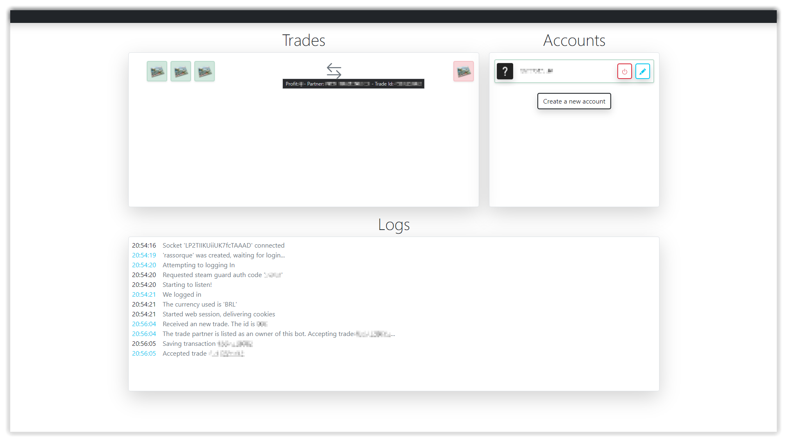

  
  
  
  

<h1 align="center">
  <strong>Steam Trader 📈</strong>
</h1>

  <i>An deployment ready and automated steam trade client!</i>

> <pre align="center">The web panel was launched at <a href=https://github.com/ArthurFiorette/steam-trader/releases/tag/v1.3.0>1.3.0</a>. Now all your work can be done on your browser!</pre>

 

  

## About

This project is an open source initiative to host multiple steam accounts making them exchange bots, automatically calculating the prices and items in each exchange sent and responding to them at the same time, like the Trading Card Exchange bots. We still have a lot to improve, such as a better interface, smarter verification steps, etc. Feel free to ask any questions or suggestions.

## Downloading

Open this repository [releases](https://github.com/ArthurFiorette/steam-trader/releases) tab and download the latest source code **.zip** file.

## Configuration

A config.json file already existed in previous versions, however, now everything is officially configured by our panel. To access it, start the application correctly and go to [localhost:1227](http://localhost:1227)

#### SDA, Shared Secret and Identity Secret

To register a steam account with **steam-trader**, you need to know the `Shared Secret` and `Identity Secret` of your account. These two secrets are responsible for the automatic generation of the steam guard mobile code and auto reconnection.

To get them easily, you will need to enable [SDA](https://github.com/Jessecar96/SteamDesktopAuthenticator) on the account and after that, you will find it [here](https://www.youtube.com/watch?v=JjdOJVSZ9Mo).

## Executing

Now, to start this application, you can **_run the [`start.cmd`](start.cmd) script at the root of this project_** and follow the installation and startup steps or run it manually as follows:

1. If you have a docker virtual machine, you can simply type `docker-compose up` or use any docker instance at any hosting service.

2. If you doesn't have any access or knowledge to use docker, you can run it having **Node.JS** installed.
   - To start the server, open the app folder, install and compile by running `npm install` and after `npm run build`. Start by running `npm start`.
   - To start the web page, open the web folder, install with `npm install` and build running `npm run build`. Start by running `npm start`.

## License

Licensed under the **GNU General Public License v3.0**. See [`LICENSE`](LICENSE) for more informations.

## Contact

See my contact information on my [GitHub Profile Page](https://github.com/ArthurFiorette) or open a new issue.
